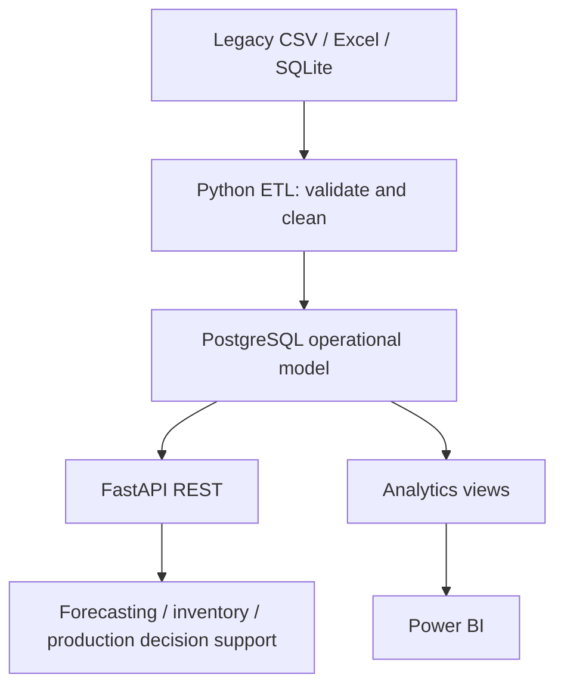

# Rivaline Manufacturing Integrated Operations Platform

Rivaline Manufacturing Ltd is a fictional organisation created for this
digital-transformation case study. All operational data, organisations,
products, formulations and transactions used by the platform are synthetic.

Rivaline represents a UK batch/process manufacturer of industrial coatings. Fragmented
spreadsheets, legacy exports and manual handoffs obscure demand, stock, purchasing,
production, quality and fulfilment. This case study aims to connect those records into
an explainable operational view and, in later phases, decision support.

## Current scope

**IMPLEMENTED — Phase 1:** modular Python foundation, environment configuration,
PostgreSQL Compose definition, 23 operational SQLAlchemy tables, deterministic synthetic
master-data seeding, `/health`, unit/constraint tests and architecture documentation.

**IMPLEMENTED - Phase 2:** deterministic SQLite/CSV/Excel legacy fixtures, auditable ETL,
quarantine, idempotent replay, reconciliation, traceability and an Alembic migration baseline.

**IMPLEMENTED - Phase 3:** versioned read-only operational/traceability APIs, eight reporting
views, shared operational KPIs and OpenAPI documentation.

**IMPLEMENTED - Phase 4:** pooled inventory intelligence, BOM requirements, explainable reorder
proposals, immutable calculation snapshots and read-only what-if analysis.

**IMPLEMENTED - Phase 5:** deterministic archived demand, monthly baseline/candidate forecasts,
chronological evaluation, immutable forecast evidence and read-only reporting APIs.

**PLANNED:** production planning, Power BI reports and authentication. No frontend, distributed
infrastructure or cloud deployment is in scope. This is a focused two-day prototype.

## Target architecture



Python 3.12, PostgreSQL (native 17.11 or Compose 16), SQLAlchemy 2, FastAPI, Pydantic 2,
pandas, scikit-learn,
pytest and Docker Compose form the stack. Pandas and scikit-learn remain available dependencies; the small Phase 5
forecasting models use transparent Decimal arithmetic. Phase 2 additionally uses openpyxl and Alembic.

## Repository

| Path | Responsibility |
|---|---|
| `api/` | App factory, routers, schemas and services |
| `database/` | Settings, lazy engine, authoritative models and synthetic seed |
| `data/legacy/` | Six generated synthetic sources and exact defect manifest |
| `etl/` | Extraction, validation, loading, audit and reconciliation |
| `analytics/` | Shared reporting-view KPI queries |
| `planning/` | Inventory rules, BOM what-if, policy fixtures and recommendation snapshots |
| `powerbi/` | Future reporting assets |
| `scripts/` | Schema creation, seeding and API entry points |
| `tests/` | Fast service-independent validation |
| `docs/` | Business case, contracts, ADR and delivery outlines |

Read [AGENTS.md](AGENTS.md) before changing shared interfaces.

## Setup (PowerShell)

Prerequisites: Python 3.12 and either native PostgreSQL (17.11 verified on Windows)
or Docker with Compose. Run commands from the repository root. Choose one database option
below; native PostgreSQL and Docker cannot both bind the same host port.

```powershell
python -m venv .venv
.\.venv\Scripts\python.exe -m pip install -e ".[dev]"
if (-not (Test-Path .env)) { Copy-Item .env.example .env }
```

Edit the Git-ignored `.env` locally and set `POSTGRES_PASSWORD` for your database role.
It is intentionally blank in the template. `.env` is ignored by Git. Environment variables override `.env`. The
application constructs its database URL safely from the individual fields, including
passwords containing punctuation. Do not commit credentials.

### A. Native PostgreSQL

Use a running native server and an existing `rivaline` database. Set `POSTGRES_HOST=localhost`,
`POSTGRES_PORT=5432`, `POSTGRES_DB=rivaline` and `POSTGRES_USER` to your existing database role
(the Windows installer default is `postgres`). Enter its password only in your local `.env`;
do not paste it into chat or tracked files. This verification used the installer role; a dedicated
application role is a later hardening task. If your database does not yet exist, create it using
your local PostgreSQL administration tool before running schema setup.

The URL is constructed as `postgresql+psycopg://<user>:<password>@<host>:<port>/<database>`.
There is no `DATABASE_URL` environment setting; use the separate `POSTGRES_*` fields.

### B. Docker Compose alternative

Keep the Compose deployment as an alternative. It requires hardware virtualization and a
working Docker runtime. It was not locally executed because virtualization is disabled on
this machine. Select a free host port if native PostgreSQL is also running.

```powershell
docker compose up -d postgres
docker compose ps
```

### Schema, seed and API (both options)

```powershell
.\.venv\Scripts\python.exe -m scripts.migrate_db
.\.venv\Scripts\python.exe -m scripts.seed_master_data
.\.venv\Scripts\python.exe -m scripts.run_api
```

Ensure the chosen server is ready before schema creation (wait for health in Compose).
`migrate_db` creates a new schema or verifies/stamps the existing Phase 1 schema without rebuilding it.
The original `init_db` remains a bootstrap-only command; use Alembic for future schema evolution. Seed inserts missing synthetic keys in one
transaction without overwriting existing records; a second run inserts zero rows. Run seeding
as a single process. Conflicting business codes fail and roll back rather than replacing data.

In another terminal:

```powershell
curl.exe -i http://127.0.0.1:8000/health
```

OpenAPI documentation is at `http://127.0.0.1:8000/docs`. `/health` returns the application
name, environment, overall status and database status: HTTP 200 for `up`; HTTP 503 for
`down` or `unconfigured`. It checks `SELECT 1`, not table readiness. Without a configured
database the API still starts and reports degraded health. No connection is opened during
module import. Connection failures are sanitized; connection timeout is three seconds.

On macOS/Linux replace `.\.venv\Scripts\python.exe` with `.venv/bin/python`, use
`cp .env.example .env`, and `curl` instead of `curl.exe`. Virtual-environment activation is
optional. `API_HOST` and `API_PORT` configure `scripts.run_api`. Compose publishes PostgreSQL
on localhost only. An existing server can be selected with `POSTGRES_HOST` and `POSTGRES_PORT`.

```powershell
docker compose stop
```

The stop command applies only to the Compose option and preserves its named PostgreSQL volume.
Changing `.env` credentials does not change
credentials in an already-initialized PostgreSQL volume; update the database role explicitly.

## Checks

```powershell
.\.venv\Scripts\python.exe -m pytest -q
.\.venv\Scripts\python.exe -m ruff check .
.\.venv\Scripts\python.exe -m ruff format --check .
# Optional live checks after schema creation and seeding:
.\.venv\Scripts\python.exe -m scripts.verify_db
.\.venv\Scripts\python.exe -m pytest -q --postgres
# Docker option only:
docker compose config --quiet
```

Default tests use SQLite with foreign keys enabled and compile PostgreSQL DDL. The explicit
`--postgres` option additionally runs relational tests against your configured live PostgreSQL,
using unique temporary schemas inside rolled-back transactions (requires CREATE on the database).
No PostgreSQL connection is required for default tests. `scripts.verify_db` is read-only and
checks public-schema contracts and seed values; its fingerprint supports repeat-run comparisons.
See [validation](docs/16-phase-1-validation.md) for actual commands and results.

## Data contracts and roadmap

Seed contains 4 products, 4 materials, 3 suppliers, 3 customers, 2 warehouses, 4 BOM versions
and 16 BOM lines (36 records). All quantities are in kg. The equal-part BOMs are deliberately
abstract relationship examples, not usable paint recipes. No historical transactions are seeded.

See [data architecture](docs/06-data-architecture.md) for relationships and limitations and
[ADR 001](docs/adr/001-prototype-architecture.md) for technology decisions.

1. Phase 1: verified foundation and native PostgreSQL integration.
2. Phase 2: synthetic legacy sources, audited ETL, quarantine, replay and migration baseline.
3. Phase 3: read APIs, traceability, reporting views and descriptive KPIs.
4. Phase 4: inventory intelligence and reorder decision support.
5. Phase 5: monthly demand forecasting and chronological evaluation.
6. Phase 6 requires separate approval; scheduling and automatic order creation have not started.

## Phase 2 demo

After configuration and master seeding:

```powershell
.\.venv\Scripts\python.exe -m scripts.generate_legacy
.\.venv\Scripts\python.exe -m scripts.run_etl run
.\.venv\Scripts\python.exe -m scripts.run_etl summary
.\.venv\Scripts\python.exe -m scripts.run_etl reconcile
.\.venv\Scripts\python.exe -m scripts.run_etl snapshot
.\.venv\Scripts\python.exe -m scripts.run_etl run
.\.venv\Scripts\python.exe -m scripts.run_etl snapshot
.\.venv\Scripts\python.exe -m scripts.run_etl trace --order SO-0001
```

Expected complete execution: 464 source rows = 416 accepted + 48 rejected. First load inserts
944 operational rows; replay inserts zero. Audits grow on every execution. Inspect
`data/quarantine/<run>/rejected.json` and `summary.json`; folders are ignored by Git.
The manifest identifies every intentional defect. Regeneration resets sources only.

See the [runbook](docs/18-etl-runbook.md), [mappings](docs/07-integration-design.md),
[data-quality policy](docs/08-data-quality.md) and [Phase 2 evidence](docs/17-phase-2-validation.md).

## Phase 3 demo

Retain the Phase 2 integrated database, then apply the view migration and start the API:

```powershell
.\.venv\Scripts\python.exe -m scripts.migrate_db
.\.venv\Scripts\python.exe -m scripts.run_api
```

In another terminal:

```powershell
curl.exe http://127.0.0.1:8000/health
curl.exe "http://127.0.0.1:8000/api/v1/sales-orders?limit=5&status=confirmed"
curl.exe "http://127.0.0.1:8000/api/v1/inventory?warehouse_id=1"
curl.exe http://127.0.0.1:8000/api/v1/traceability/order/1
curl.exe http://127.0.0.1:8000/api/v1/kpis/operations
```

Use the actual integer order ID from the list (the standard fixture starts with SO-0001).
Open `/docs` or `/openapi.json` for filters and response contracts. All business routes are GET-only;
list pages contain items/total/limit/offset. Decimal quantities are strings. No authentication is
implemented; this remains a local synthetic-data prototype.

See [API/view catalogue](docs/19-api-and-analytics.md), [KPI dictionary](docs/20-kpi-dictionary.md),
[Phase 3 validation](docs/21-phase-3-validation.md) and the [future Power BI plan](powerbi/README.md).


## Phase 4 demo

Preserve the Phase 2/3 integrated database. Policies are synthetic; recommendations do not create POs.

```powershell
.\.venv\Scripts\python.exe -m scripts.migrate_db
.\.venv\Scripts\python.exe -m scripts.run_planning seed-policies
.\.venv\Scripts\python.exe -m scripts.run_planning positions
.\.venv\Scripts\python.exe -m scripts.run_planning requirements
.\.venv\Scripts\python.exe -m scripts.run_planning calculate
.\.venv\Scripts\python.exe -m scripts.run_planning calculate
.\.venv\Scripts\python.exe -m scripts.run_api
```

In another terminal:

```powershell
curl.exe http://127.0.0.1:8000/api/v1/inventory/positions
curl.exe http://127.0.0.1:8000/api/v1/planning/material-requirements
curl.exe "http://127.0.0.1:8000/api/v1/reorder-recommendations?status=proposed"
curl.exe "http://127.0.0.1:8000/api/v1/planning/material-availability?product_id=1&quantity=10000&unit_of_measure=kg"
```

The preserved fixture yields two proposals: RM-002 1,000 kg and RM-003 1,500 kg. Exact-input replay
adds none. All production is completed, so current material requirements are empty. The what-if
exposes 500 kg shortage for each material without saving anything. Stock is pooled across warehouses;
reservations and known requirements are conservatively additive, and confirmed purchases are assumed
wholly outstanding. Read the [calculation contract](docs/22-inventory-and-reorder.md) and
[validation report](docs/23-phase-4-validation.md) before interpreting these demonstration values.


## Phase 5 demo

The original sales history spans two months. The separately labelled 24-month archived-demand
fixture supports evaluation without changing prior operational sales or inventory planning.

```powershell
.\.venv\Scripts\python.exe -m scripts.migrate_db
.\.venv\Scripts\python.exe -m scripts.run_forecasting generate-history
.\.venv\Scripts\python.exe -m scripts.run_forecasting ingest-history
.\.venv\Scripts\python.exe -m scripts.run_forecasting forecast
.\.venv\Scripts\python.exe -m scripts.run_forecasting forecast
.\.venv\Scripts\python.exe -m scripts.run_api
```

The forecast command returns a run_code, all candidate metrics and 12 product-month forecasts.
Replay adds no rows. To inspect an incremental material scenario, use the returned code:

```powershell
.\.venv\Scripts\python.exe -m scripts.run_forecasting demo-bom --run-code <returned-run-code> --product-id 1
curl.exe http://127.0.0.1:8000/api/v1/forecasts
curl.exe http://127.0.0.1:8000/api/v1/forecasts/1
curl.exe "http://127.0.0.1:8000/api/v1/forecasts/evaluation?scope=overall&evaluation_split=test"
curl.exe "http://127.0.0.1:8000/api/v1/forecasts/history?product_id=1"
```

Dates default to cutoff 2026-09-30 and forecast October-December 2026. Archive import rejects missing
months and conflicting replay. Model selection uses validation MAE; every candidate's final holdout
results are retained. Forecasts do not create orders or reorder proposals. Read the
[forecast contract](docs/24-demand-forecasting.md) and [Phase 5 validation](docs/25-phase-5-validation.md)
for measured synthetic results and limitations. No calibrated prediction intervals are claimed.
