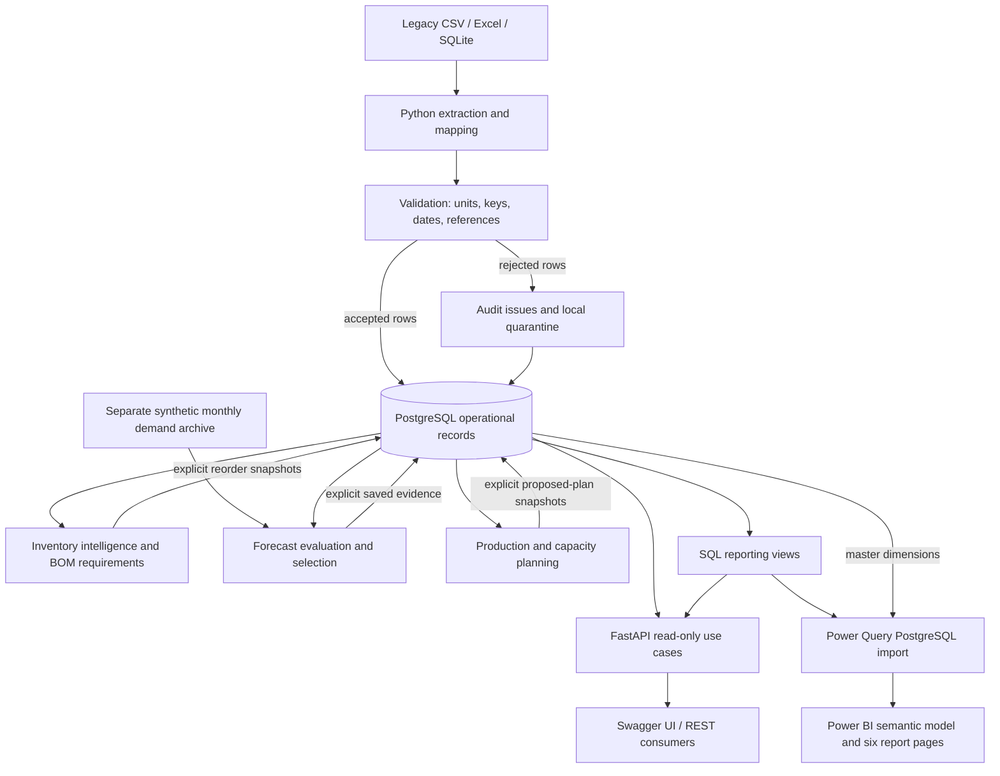

# Rivaline Manufacturing Integrated Operations Platform

Rivaline Manufacturing Ltd is a fictional organisation created for this
digital-transformation case study. All operational data, organisations,
products, formulations and transactions used by the platform are synthetic.

Rivaline represents a UK batch/process manufacturer of industrial coatings. Fragmented
spreadsheets, legacy exports and manual handoffs obscure demand, stock, purchasing,
production, quality and fulfilment. This case study aims to connect those records into
an explainable operational view with forecasting, inventory intelligence and capacity decision support.

## Contents

- [Manufacturing decisions, backed by traceable data](#manufacturing-decisions-backed-by-traceable-data)
- [Power BI showcase](#power-bi-showcase)
- [Technical demonstration](#technical-demonstration)
- [Current scope](#current-scope)
- [Target architecture](#target-architecture)
- [Manufacturing business problem](#manufacturing-business-problem)
- [Technology choices](#technology-choices)
- [Database design and traceability](#database-design-and-traceability)
- [Legacy integration and data quality](#legacy-integration-and-data-quality)
- [FastAPI and operational analytics](#fastapi-and-operational-analytics)
- [Inventory and procurement decision support](#inventory-and-procurement-decision-support)
- [Demand forecasting and evaluation](#demand-forecasting-and-evaluation)
- [Production and capacity decision support](#production-and-capacity-decision-support)
- [Repository](#repository)
- [Setup (PowerShell)](#setup-powershell)
- [Checks](#checks)
- [Data contracts and roadmap](#data-contracts-and-roadmap)
- [Phase 2 demo](#phase-2-demo)
- [Phase 3 demo](#phase-3-demo)
- [Phase 4 demo](#phase-4-demo)
- [Phase 5 demo](#phase-5-demo)
- [Phase 6 demo](#phase-6-demo)
- [Phase 7 Power BI](#phase-7-power-bi)
- [Validation evidence and limitations](#validation-evidence-and-limitations)
- [Documentation index](#documentation-index)

## Manufacturing decisions, backed by traceable data

An independent, fictional **manufacturing digital transformation case study** for a general
professional portfolio. Rivaline demonstrates how software engineering and applied analysis can
connect process-manufacturing records into operational intelligence and explainable decision support.
All business scenarios and results are synthetic; no real-world deployment or productivity gain is claimed.

| Capability | Evidence in this project | Business purpose |
|---|---|---|
| Data integration | CSV, Excel and SQLite records mapped into PostgreSQL | Replace disconnected operational views with consistent records |
| ETL and data quality | Validation, quarantine, source keys, run lineage and idempotent replay | Make rejected data visible and prevent duplicate operational loads |
| Traceability | Sales order, batch, material, supplier, quality and shipment relationships | Investigate an exception from customer demand back to source records |
| Forecasting | Chronological evaluation and retained model/run evidence | Make demand assumptions and prediction error inspectable |
| Inventory intelligence | BOM requirements and explainable reorder proposals | Identify material risk without automatically creating purchases |
| Capacity planning | Stock netting, whole-batch allocation and shared resource constraints | Expose feasible production and unmet demand before release |
| Management reporting | Six validated Power BI pages over PostgreSQL views | Connect business questions to reproducible calculations |

**Fictional business-case objective: improve production efficiency by 20%. This is a proposed target,
not a measured achievement.** A real pilot would first agree a baseline such as quality-accepted
kg per scheduled production labour-hour, then compare equivalent product mixes and shifts after implementation.
A 20% relative improvement would mean `(pilot efficiency / baseline efficiency - 1) * 100 = 20%`.
Quality, rework, service levels and overtime would need to be monitored alongside throughput.
This prototype demonstrates decision support; it does not establish a causal productivity gain,
financial return or OEE improvement.

## Power BI showcase

These are user-captured screenshots of the validated synthetic dashboard. Only external Desktop
interface strips have been cropped; report figures, labels and visible table content are preserved.
Click an image to inspect it at its saved resolution. Scrollable tables show the captured viewport;
the PBIP provides the interactive report.

### Executive operations

A management overview of 48 orders, two materials at risk, 100% batch QC pass and 8.535K kg forecast
demand. The exception panel highlights 844 kg of capacity-constrained production for follow-up.

[](docs/images/powerbi/executive.png)

### Inventory and procurement

Compare current/projected material positions with 2,500 kg of proposed replenishment. Supplier/material
order detail supports procurement investigation; ordered quantity is explicitly not evidence of receipt.

[](docs/images/powerbi/inventory.png)

### Demand and forecasting

Compare archived demand, future forecasts and holdout predictions. Selected-policy holdout MAE of
18.416667 kg and RMSE of 23.973944 kg communicate uncertainty alongside the 8.535K kg forecast.

[](docs/images/powerbi/forecasting.png)

### Production and capacity

Translate forecast demand into roughly 1,176 kg of net production requirement. December mixing
requires 11.76 hours against 10 available, leaving 844 kg unmet under the whole-batch priority policy.
The broad resource chart aggregates the horizon; the December mixing cards show the specific bottleneck.

[](docs/images/powerbi/production.png)

### Six pages, one reporting model

| Page | Management question |
|---|---|
| 01 Executive Operations | Which operational exceptions need attention? |
| 02 Inventory & Procurement | Which materials need replenishment and which suppliers have orders? |
| 03 Demand & Forecasting | What demand is expected, and how did the selected models perform? |
| 04 Production & Capacity | What can be produced within material and resource constraints? |
| 05 Quality & Data Trust | Are batch results and integrated source records trustworthy? |
| 06 Transformation & Value | How do the technical changes support better business decisions? |

Power BI uses **Import mode**, connecting directly to PostgreSQL through Power Query's
`PostgreSQL.Database` connector. Nineteen imported entities (five dimensions and fourteen reporting
entities) feed a 21-table model, with 25 single-direction relationships and 39 DAX measures.
Trusted SQL reporting views expose ETL/operational results and saved planning snapshots; Power BI
does not call FastAPI to refresh. Server, database and selected run codes are explicit parameters.
Credentials belong in Desktop's local credential store, never in the PBIP or Git.

All six pages passed user-confirmed Desktop open, authentication, refresh and rendering validation,
including the repaired supplier/material visual. See [validation evidence](docs/29-phase-7-validation.md).
Import refresh is manual; no gateway, scheduled refresh or cloud deployment is configured.

## Technical demonstration

Use the [10-minute technical demonstration runbook](docs/32-demo-runbook.md) for a prepared
Power BI, Swagger UI and ETL walkthrough. It includes parameter discovery, exact commands,
expected results, troubleshooting and a screenshot fallback. No database rebuild is needed
while demonstrating.

## Current scope

**IMPLEMENTED — Phase 1:** modular Python foundation, environment configuration,
PostgreSQL Compose definition, 23 operational SQLAlchemy tables, deterministic synthetic
master-data seeding, `/health`, unit/constraint tests and architecture documentation.

**IMPLEMENTED - Phase 2:** deterministic SQLite/CSV/Excel legacy fixtures, auditable ETL,
quarantine, idempotent replay, reconciliation, traceability and an Alembic migration baseline.

**IMPLEMENTED - Phase 3:** versioned read-only operational/traceability APIs, eight reporting
views, shared operational KPIs and OpenAPI documentation.

**IMPLEMENTED - Phase 4:** pooled inventory intelligence, BOM requirements, explainable reorder
proposals, immutable calculation snapshots and read-only what-if analysis.

**IMPLEMENTED - Phase 5:** deterministic archived demand, monthly baseline/candidate forecasts,
chronological evaluation, immutable forecast evidence and read-only reporting APIs.

**IMPLEMENTED - Phase 6:** demand netting, batch sizing, shared material/capacity allocation,
computational what-if APIs and reproducible proposed production snapshots.

**IMPLEMENTED - Phase 7:** Power BI import model, DAX catalogue and six PBIR report
pages; code/PostgreSQL checks and user-confirmed Desktop refresh/render validation are complete.

**PLANNED:** authentication. No frontend, distributed
infrastructure or cloud deployment is in scope. This is a local synthetic-data portfolio prototype.

## Target architecture



Arrows describe actual dependencies, not a mandatory sequence of HTTP calls. Python services
read PostgreSQL; explicit CLI commands save decision-support evidence. API planning calls compute
results without persisting them. Power BI reads views and master dimensions directly, not through
FastAPI. Row issues are recorded in PostgreSQL, while raw quarantine exports remain local. An
ETL rejection does not create a valid operational row. Forecasting uses a separately labelled archive,
not the short operational sales history. Refresh does not recalculate or release production orders.


Python 3.12, PostgreSQL (native 17.11 or Compose 16), SQLAlchemy 2, FastAPI, Pydantic 2,
pandas, scikit-learn,
pytest and Docker Compose form the stack. Pandas and scikit-learn remain available dependencies; the small Phase 5
forecasting models use transparent Decimal arithmetic. Phase 2 additionally uses openpyxl and Alembic.

## Manufacturing business problem

| Fragmented process | Resulting risk | Implemented response |
|---|---|---|
| CSV/Excel exports and a legacy SQLite sales store | Different keys, formats and units | Explicit source contracts, normalization and canonical kg quantities |
| Separate sales and purchasing records | Weak customer-to-supplier traceability | Foreign-key relationships, batch consumption and order trace APIs |
| Poor stock visibility | Material shortages or misleading availability | Pooled on-hand, reservations, incoming assumptions and BOM requirements |
| Inconsistent data and manual reconciliation | Errors hidden in totals | Quarantine, run audit, immutable source identities and source-to-target checks |
| Uncertain demand | Production decisions based on intuition alone | Three explainable forecasting candidates with chronological evaluation |
| Finite manufacturing capacity | Demand exceeds feasible whole batches | Resource/month capacity, priorities and explicit unmet demand |
| Fragmented reporting | Managers cannot see the same exceptions | Trusted reporting views and a six-page Power BI model |

The platform demonstrates integration and decision support on synthetic records. It does not
claim to replace a manufacturing execution system, certify formulations or improve real plant output.

## Technology choices

| Technology | Actual role and rationale |
|---|---|
| Python 3.12 | Small, inspectable ETL and decision-support modules plus explicit command-line workflows |
| PostgreSQL | Authoritative relational store, transactional integrity, constraints and SQL reporting views |
| SQLite | Synthetic legacy sales source and fast isolated tests; not the deployed operational database |
| CSV / Excel | Representative departmental source formats; read with the standard library and openpyxl |
| pandas / scikit-learn | Installed dependencies from the original stack; not used in implemented extraction or forecasting algorithms |
| SQLAlchemy 2 | Typed model mappings, bound SQL expressions, sessions and controlled transactions |
| Alembic | Versioned schema/view migrations rather than schema changes at application startup |
| FastAPI / Pydantic 2 | Typed HTTP routes, validation, JSON response schemas and generated OpenAPI/Swagger UI |
| REST / SQL views | Readable operational resource contracts and stable reporting grains |
| Decimal forecasting | Naive, three-month moving average and linear trend with explicit evaluation and rounding |
| Power BI / Power Query / DAX | Import PostgreSQL data, model relationships, compute named measures and present management pages |
| pytest / Ruff | Behavioral, relational and integration evidence; linting and consistent Python formatting |
| Git / GitHub | Reviewable source checkpoints and public documentation; secrets and cached report data excluded |
| Docker Compose | Optional local PostgreSQL 16 alternative; verified native Windows server is PostgreSQL 17.11 |

The project is a modular monolith. Modules share one authoritative schema while keeping HTTP,
ETL and planning responsibilities separate. No frontend framework, message broker or cloud service
is required. See [architecture](docs/05-system-architecture.md) and [ADR 001](docs/adr/001-prototype-architecture.md).

## Database design and traceability

The verified model contains **35 application tables**, plus Alembic's revision table. The preserved
demo has **1,497 application records**; this count includes audit and decision-support evidence,
not just operational transactions. Every table has a primary key. Business codes/source identities,
foreign keys, unique constraints and checks provide complementary integrity guarantees.

| Entity group | Role and relationships |
|---|---|
| Products, raw materials, suppliers, customers, warehouses | Canonical synthetic identities and units |
| Inventory | One item/warehouse/lot position; distinguishes finished products from raw materials |
| Bills of material and component lines | A product/version/output basis linked to required raw-material quantities |
| Sales orders / lines | Customer demand for products; lines connect to production and shipments |
| Purchase orders / lines | Supplier/material commitments; consumption records link purchases to actual batches |
| Production orders / batches | Intended work and recorded batch output, linked to sales lines and BOMs |
| Quality inspections / material consumption | Batch evidence, pass/fail results and supplier-lot consumption |
| Shipments / shipment lines | Dispatch quantities linked to order lines and production batches |
| ETL runs / data-quality issues | Execution counters, source keys and rejected-record evidence |
| Planning policies / runs / recommendations | Reproducible inventory decisions, not purchase orders |
| Demand observations / forecast runs / metrics / backtests / forecasts | Archive lineage, chronological evaluation and immutable forecast evidence |
| Resources / production policies / plan runs / lines / capacity / material results | Proposed allocations with shared constraints and explanations |

A trace follows customer -> sales order line -> production order -> batch -> quality/consumption ->
purchase order line -> material/supplier, with shipment links back to the customer line and batch.
This is recorded lineage; a BOM alone does not prove which supplier lot was consumed.
Quantities and money use PostgreSQL NUMERIC and Python Decimal. External SQL writers must maintain
`updated_at`; no traceability cascade-delete workflow is provided. See [data architecture](docs/06-data-architecture.md).

## Legacy integration and data quality

Six deterministic synthetic inputs model sales, purchasing, inventory, production, quality and
dispatch. Extraction enforces exact headers. Transformation normalizes identifiers/statuses,
parses dates and Decimal quantities, converts supported gram inputs to kg, and checks references,
units and domain rules. No operational quantity is silently filled in.

The loader uses source identities and business keys. An unchanged replay is accepted without
inserting another operational record; a conflicting edit to accepted history is rejected.
One accepted source row may create several related targets, so accepted rows and inserted rows
are different counts. Each rejected row gets a rule and source context; raw exports stay under
ignored `data/quarantine/<run>/`. Run-level audit survives fatal failures.

| Verified example | Outcome |
|---|---|
| `SALE-0001` / `SO-0001`, customer SYN-CUS-001, product SYN-FG-001, 100 kg at 12.50 | Accepted; sales header and line linked to canonical master IDs |
| Repeated `SALE-0001` in the sales source (`DUPLICATE_RECORD`), plus unknown-reference/date/quantity defects | Rejected with rule-coded evidence; no invented quantity or reference |
| One complete execution | 464 extracted = 416 accepted + 48 rejected; first load inserts 944 operational target rows |
| Exact replay | 416 accepted again; zero new operational target rows; a new run and 48 new issue events |
| Two preserved executions | 928 extraction events, 832 acceptance events and 96 rejection/issue events |

A rejected source record is an expected row-level validation outcome. A fatal missing/malformed
file causes a failed pipeline execution and rolls back that attempt's operational transaction.
An export failure after database commit is explicitly recorded separately. Reconciliation checks
source hashes, audit totals, quarantine identities, accepted target receipts and independent kg totals.
The **89.66% acceptance / 10.34% rejection** rates describe the intentionally dirty fixture, not
production data-quality performance. See [ETL runbook](docs/18-etl-runbook.md) and [data-quality rules](docs/08-data-quality.md).

## FastAPI and operational analytics

`api/main.py` wires routers, schemas and services. Request-scoped PostgreSQL sessions use repeatable,
read-only transactions. Pydantic rejects invalid query/body shapes; SQLAlchemy uses bound values.
`/docs` provides Swagger UI and `/openapi.json` the machine-readable contract.

| Route group | Examples | Behavior |
|---|---|---|
| Health / masters | `/health`, `/api/v1/products`, `/api/v1/raw-materials` | Connectivity and canonical identities |
| Operations | `/api/v1/sales-orders`, `/api/v1/inventory`, `/api/v1/production-batches` | Filtered lists and operational detail |
| Traceability | `/api/v1/traceability/order/{order_id}` | Nested customer, batch, quality, material and dispatch chain |
| Audit / KPIs | `/api/v1/etl-runs`, `/api/v1/data-quality-issues`, `/api/v1/kpis/operations` | Run evidence and shared SQL-view measures |
| Inventory planning | `/api/v1/inventory/positions`, `/api/v1/reorder-recommendations` | Explained risk and stored proposals |
| Forecasting | `/api/v1/forecasts`, `/api/v1/forecasts/evaluation`, `/api/v1/forecasts/history` | Saved forecast and archive evidence |
| Production planning | `/api/v1/planning/production-plan`, `/api/v1/planning/capacity` | Read-only calculations for a selected forecast run |
| Scenario calculation | `POST /api/v1/planning/production-plan/what-if` | JSON input; computational only, no database writes |

List responses normally contain `items`, `total`, `limit` and `offset`; defaults are 50/0 and the
maximum limit is 200. Additional planning metadata can accompany a page. Decimal quantities
serialize as JSON strings. Read the full schemas rather than assuming every endpoint has identical fields.
HTTP 200 means success, 404 a missing resource, 422 invalid request data, 409 a planning conflict
and 503 unavailable operational data. There is no production-grade authentication/authorisation.

```powershell
curl.exe "http://127.0.0.1:8000/api/v1/sales-orders?limit=5"
curl.exe "http://127.0.0.1:8000/api/v1/kpis/operations"
```

The preserved fixture returns a sales page with `total: 48`, `limit: 5`, `offset: 0`; KPI fields
include `order_count: 48`, `production_batch_count: 48` and `data_quality_issue_count: 96`.
These are response excerpts, not substitutes for the complete schema. Use the returned order ID
for traceability. See [API catalogue](docs/19-api-and-analytics.md) and [KPI dictionary](docs/20-kpi-dictionary.md).

## Inventory and procurement decision support

`projected = on hand - reserved + assumed confirmed incoming - requirements`.
Stock is pooled across warehouses. Requirements come from open work and BOM relationships;
confirmed incoming is assumed wholly outstanding because the prototype has no receipt-balance model.
A proposed reorder is not incoming stock. Reorder triggers use strict `<`, so equality does not trigger.

| Material | Projected kg | Reorder point kg | Target kg | Minimum order kg | Proposed kg |
|---|---:|---:|---:|---:|---:|
| SYN-RM-002 | 2,000 | 2,500 | 3,000 | 100 | 1,000 |
| SYN-RM-003 | 2,000 | 2,400 | 3,000 | 1,500 | 1,500 |

The rule is `max(target - projected, minimum order)` when below the reorder point: total **2,500 kg**.
Safety stock classifies risk; it is not the target quantity. A 100 kg abstract BOM containing 25 kg
of each of four materials requires 250 kg of each for a 1,000 kg batch. These are synthetic relationship
examples, not usable formulations. Recommendations never automatically create purchase orders.
See [inventory contract](docs/22-inventory-and-reorder.md).

## Demand forecasting and evaluation

A separate 24-month archive (October 2024-September 2026) provides 192 observations aggregated to
96 product-months. It does not extend or overwrite the two-month operational sales history.
Each of four products is evaluated using naive (last value), moving average (last three values)
and least-squares linear trend models. All implemented model arithmetic uses Decimal.

Validation trains on the first 12, 15 and 18 months, predicting three months after each origin.
The lowest validation MAE selects a model per product; ties favor the simpler candidate order.
The final holdout trains on 21 months and tests the final three. Selection never uses holdout
errors. The selected model is refit to all 24 months for October-December 2026: 12 forecasts,
**8,535 kg** total (up to six-decimal rounding).

`MAE = mean(abs(actual - predicted))`; `RMSE = sqrt(mean((actual - predicted)^2))`.
The selected-policy holdout metrics are **18.416667 kg MAE** and **23.973944 kg RMSE**, pooled over
12 selected product/month predictions. They differ from candidate-wide evaluation rows.
These synthetic historical errors do not guarantee real-world accuracy; no calibrated prediction
intervals or seasonal model is implemented. See [forecast contract](docs/24-demand-forecasting.md).

## Production and capacity decision support

Forecast-to-production planning consumes finished stock once across the horizon, sizes batches,
explodes BOM requirements and allocates whole batches in month/priority/product-code order.
Minimum batch is 200 kg, preferred 1,000 kg, maximum 1,200 kg in the synthetic policy; each product
uses one resource at 100 kg/h. Capacity is residual monthly capacity, not a full shift calendar.

For SYN-FG-002, October and November each consume 948 kg from its initial 2,000 kg stock.
December therefore has **948 kg gross demand - 104 kg inventory offset = 844 kg net requirement**.
That product needs **8.44 hours**. Higher-priority SYN-FG-001 needs 331.999999 kg, rounded up to
**3.32 processing hours**. Together SYN-MIX needs **11.76h against 10h**, a **1.76h shortfall**.
After allocating FG-001, only 6.68h remain, so the entire FG-002 844kg batch stays unmet.
Product-specific hours must not be confused with the overall resource/month total.

The horizon's net requirement is approximately **1,176 kg**, with **844 kg unmet**. Materials
are sufficient in this example; spare finishing capacity cannot substitute for the mixing resource.
The separate manual 5,000kg FG-001 scenario nets 2,000kg stock, proposes three 1,000kg batches,
needs 30h against 10h, allocates one batch and leaves 2,000kg unmet. It is an alternative scenario,
not extra demand added to the forecast. Outputs are proposals, not approved schedules or releases.
Setup/changeovers, expiry, workforce scheduling and optimal sequencing are outside scope.
See [planning contract](docs/26-production-planning.md).

## Repository

| Path | Responsibility |
|---|---|
| `api/` | App factory, routers, schemas and services |
| `database/` | Settings, lazy engine, authoritative models and synthetic seed |
| `data/legacy/` | Six generated synthetic sources and exact defect manifest |
| `etl/` | Extraction, validation, loading, audit and reconciliation |
| `analytics/` | Shared reporting-view KPI queries |
| `planning/` | Inventory, forecasting, production planning and auditable decision-support snapshots |
| `powerbi/` | Validated PBIP/PBIR/TMDL report, model and reproducibility assets |
| `scripts/` | Schema creation, seeding and API entry points |
| `tests/` | Fast service-independent validation |
| `docs/` | Business case, contracts, ADR and delivery outlines |

Read [AGENTS.md](AGENTS.md) before changing shared interfaces.

## Setup (PowerShell)

Prerequisites: Python 3.12 and either native PostgreSQL (17.11 verified on Windows)
or Docker with Compose. Run commands from the repository root. Choose one database option
below; native PostgreSQL and Docker cannot both bind the same host port.

```powershell
python -m venv .venv
.\.venv\Scripts\python.exe -m pip install -e ".[dev]"
if (-not (Test-Path .env)) { Copy-Item .env.example .env }
```

Edit the Git-ignored `.env` locally and set `POSTGRES_PASSWORD` for your database role.
It is intentionally blank in the template. `.env` is ignored by Git. Environment variables override `.env`. The
application constructs its database URL safely from the individual fields, including
passwords containing punctuation. Do not commit credentials.

### A. Native PostgreSQL

Use a running native server and an existing `rivaline` database. Set `POSTGRES_HOST=localhost`,
`POSTGRES_PORT=5432`, `POSTGRES_DB=rivaline` and `POSTGRES_USER` to your existing database role
(the Windows installer default is `postgres`). Enter its password only in your local `.env`;
do not paste it into chat or tracked files. This verification used the installer role; a dedicated
application role is a later hardening task. If your database does not yet exist, create it using
your local PostgreSQL administration tool before running schema setup.

The URL is constructed as `postgresql+psycopg://<user>:<password>@<host>:<port>/<database>`.
There is no `DATABASE_URL` environment setting; use the separate `POSTGRES_*` fields.

### B. Docker Compose alternative

Keep the Compose deployment as an alternative. It requires hardware virtualization and a
working Docker runtime. It was not locally executed because virtualization is disabled on
this machine. Select a free host port if native PostgreSQL is also running.

```powershell
docker compose up -d postgres
docker compose ps
```

### Schema, seed and API (both options)

```powershell
.\.venv\Scripts\python.exe -m scripts.migrate_db
.\.venv\Scripts\python.exe -m scripts.seed_master_data
.\.venv\Scripts\python.exe -m scripts.run_api
```

Ensure the chosen server is ready before schema creation (wait for health in Compose).
`migrate_db` creates a new schema or verifies/stamps the existing Phase 1 schema without rebuilding it.
The original `init_db` remains a bootstrap-only command; use Alembic for future schema evolution. Seed inserts missing synthetic keys in one
transaction without overwriting existing records; a second run inserts zero rows. Run seeding
as a single process. Conflicting business codes fail and roll back rather than replacing data.

In another terminal:

```powershell
curl.exe -i http://127.0.0.1:8000/health
```

OpenAPI documentation is at `http://127.0.0.1:8000/docs`. `/health` returns the application
name, environment, overall status and database status: HTTP 200 for `up`; HTTP 503 for
`down` or `unconfigured`. It checks `SELECT 1`, not table readiness. Without a configured
database the API still starts and reports degraded health. No connection is opened during
module import. Connection failures are sanitized; connection timeout is three seconds.

On macOS/Linux replace `.\.venv\Scripts\python.exe` with `.venv/bin/python`, use
`cp .env.example .env`, and `curl` instead of `curl.exe`. Virtual-environment activation is
optional. `API_HOST` and `API_PORT` configure `scripts.run_api`. Compose publishes PostgreSQL
on localhost only. An existing server can be selected with `POSTGRES_HOST` and `POSTGRES_PORT`.

```powershell
docker compose stop
```

The stop command applies only to the Compose option and preserves its named PostgreSQL volume.
Changing `.env` credentials does not change
credentials in an already-initialized PostgreSQL volume; update the database role explicitly.

### Preparing the full dashboard on a fresh database

Master seeding alone does not populate the dashboard. On a **new disposable demonstration database**,
follow the Phase 2, 4, 5 and 6 workflows below in order: ingest the synthetic legacy sources, seed
inventory policies and calculate recommendations, ingest archive demand and generate forecasts,
then seed production policies and save the forecast plan. These preparation commands write data.
The second ETL run demonstrates replay and is needed to match the captured 96 issue events.

Use the emitted forecast, reorder and plan run codes in Power BI's `ForecastRunCode`,
`ReorderRunCode` and `PlanRunCode` parameters; confirm `DatasetCode`, `Server` and `Database` too.
Do not assume copied snapshot codes match a different database. Open the checked-in PBIP directly;
`build_powerbi` is optional and overwrites generated files, so it is not part of demonstration setup.

### Sequential fresh-database preparation

Run this only against a new disposable demonstration database after migrations and master seeding
above. Every ingestion/calculation save below is intentional preparation, not a read-only demo.
Check each command succeeds before continuing. Reusing a populated database can add audit runs.

```powershell
.\.venv\Scripts\python.exe -m scripts.generate_legacy
.\.venv\Scripts\python.exe -m scripts.run_etl run
.\.venv\Scripts\python.exe -m scripts.run_etl run
.\.venv\Scripts\python.exe -m scripts.run_etl reconcile
.\.venv\Scripts\python.exe -m scripts.run_planning seed-policies
$reorder = .\.venv\Scripts\python.exe -m scripts.run_planning calculate | ConvertFrom-Json
.\.venv\Scripts\python.exe -m scripts.run_forecasting generate-history
.\.venv\Scripts\python.exe -m scripts.run_forecasting ingest-history
$forecast = .\.venv\Scripts\python.exe -m scripts.run_forecasting forecast --cutoff 2026-09-30 | ConvertFrom-Json
.\.venv\Scripts\python.exe -m scripts.run_production seed-policies
$plan = .\.venv\Scripts\python.exe -m scripts.run_production save-forecast --forecast-run-code $forecast.run_code | ConvertFrom-Json
$reorder.run_code
$forecast.run_code
$plan.plan_run_code
```

Use those three emitted values for the corresponding Power Query parameters. Keep
`DatasetCode=SYN-DEMAND-24M-V1` for this fixture. These commands were checked against actual CLI
entry points; this phase did not execute this write sequence on the preserved database. Generator,
ingestion, migration and replay behaviors are exercised by isolated automated tests.

## Checks

```powershell
.\.venv\Scripts\python.exe -m pytest -q
.\.venv\Scripts\python.exe -m ruff check .
.\.venv\Scripts\python.exe -m ruff format --check .
# Optional live checks after schema creation and seeding:
.\.venv\Scripts\python.exe -m scripts.verify_db
.\.venv\Scripts\python.exe -m pytest -q --postgres
# Docker option only:
docker compose config --quiet
```

Default tests use SQLite with foreign keys enabled and compile PostgreSQL DDL. The explicit
`--postgres` option additionally runs relational tests against your configured live PostgreSQL,
using unique temporary schemas inside rolled-back transactions (requires CREATE on the database).
No PostgreSQL connection is required for default tests. `scripts.verify_db` is read-only and
checks public-schema contracts and seed values; its fingerprint supports repeat-run comparisons.
See [validation](docs/16-phase-1-validation.md) for actual commands and results.

Power BI source checks and read-only integration checks for the prepared demonstration dataset:

```powershell
.\.venv\Scripts\python.exe -m scripts.validate_powerbi
.\.venv\Scripts\python.exe -m pytest -q tests/test_powerbi.py --postgres
```

The BI PostgreSQL tests expect the documented synthetic dataset and selected snapshots. Schema
checks include explicit 2.12 structural compatibility validation for Desktop-saved 2.13 visuals;
the exact 2.13 schema URL was unavailable. Automated checks do not replace manual Desktop rendering.

## Data contracts and roadmap

Seed contains 4 products, 4 materials, 3 suppliers, 3 customers, 2 warehouses, 4 BOM versions
and 16 BOM lines (36 records). All quantities are in kg. The equal-part BOMs are deliberately
abstract relationship examples, not usable paint recipes. No historical transactions are seeded.

See [data architecture](docs/06-data-architecture.md) for relationships and limitations and
[ADR 001](docs/adr/001-prototype-architecture.md) for technology decisions.

1. Phase 1: verified foundation and native PostgreSQL integration.
2. Phase 2: synthetic legacy sources, audited ETL, quarantine, replay and migration baseline.
3. Phase 3: read APIs, traceability, reporting views and descriptive KPIs.
4. Phase 4: inventory intelligence and reorder decision support.
5. Phase 5: monthly demand forecasting and chronological evaluation.
6. Phase 6: monthly production proposals and capacity decision support; no automatic order release.
7. Phase 7: management reporting assets; Desktop refresh/render validation passed.
8. Phase 8: portfolio showcase, command verification and demonstration readiness.
9. Phase 9: end-to-end validation, comprehensive documentation and technical demonstration readiness.

## Phase 2 demo

After configuration and master seeding:

```powershell
.\.venv\Scripts\python.exe -m scripts.generate_legacy
.\.venv\Scripts\python.exe -m scripts.run_etl run
.\.venv\Scripts\python.exe -m scripts.run_etl summary
.\.venv\Scripts\python.exe -m scripts.run_etl reconcile
.\.venv\Scripts\python.exe -m scripts.run_etl snapshot
.\.venv\Scripts\python.exe -m scripts.run_etl run
.\.venv\Scripts\python.exe -m scripts.run_etl snapshot
.\.venv\Scripts\python.exe -m scripts.run_etl trace --order SO-0001
```

Expected complete execution: 464 source rows = 416 accepted + 48 rejected. First load inserts
944 operational rows; replay inserts zero. Audits grow on every execution. Inspect
`data/quarantine/<run>/rejected.json` and `summary.json`; folders are ignored by Git.
The manifest identifies every intentional defect. Regeneration resets sources only.

See the [runbook](docs/18-etl-runbook.md), [mappings](docs/07-integration-design.md),
[data-quality policy](docs/08-data-quality.md) and [Phase 2 evidence](docs/17-phase-2-validation.md).

## Phase 3 demo

Retain the Phase 2 integrated database, then apply the view migration and start the API:

```powershell
.\.venv\Scripts\python.exe -m scripts.migrate_db
.\.venv\Scripts\python.exe -m scripts.run_api
```

In another terminal:

```powershell
curl.exe http://127.0.0.1:8000/health
curl.exe "http://127.0.0.1:8000/api/v1/sales-orders?limit=5&status=confirmed"
curl.exe "http://127.0.0.1:8000/api/v1/inventory?warehouse_id=1"
curl.exe http://127.0.0.1:8000/api/v1/traceability/order/1
curl.exe http://127.0.0.1:8000/api/v1/kpis/operations
```

Use the actual integer order ID from the list (the standard fixture starts with SO-0001).
Open `/docs` or `/openapi.json` for filters and response contracts. The Phase 3 business routes are GET-only;
list pages contain items/total/limit/offset. Decimal quantities are strings. No authentication is
implemented; this remains a local synthetic-data prototype.

See [API/view catalogue](docs/19-api-and-analytics.md), [KPI dictionary](docs/20-kpi-dictionary.md),
[Phase 3 validation](docs/21-phase-3-validation.md) and the [Power BI project](powerbi/README.md).


## Phase 4 demo

Preserve the Phase 2/3 integrated database. Policies are synthetic; recommendations do not create POs.

```powershell
.\.venv\Scripts\python.exe -m scripts.migrate_db
.\.venv\Scripts\python.exe -m scripts.run_planning seed-policies
.\.venv\Scripts\python.exe -m scripts.run_planning positions
.\.venv\Scripts\python.exe -m scripts.run_planning requirements
.\.venv\Scripts\python.exe -m scripts.run_planning calculate
.\.venv\Scripts\python.exe -m scripts.run_planning calculate
.\.venv\Scripts\python.exe -m scripts.run_api
```

In another terminal:

```powershell
curl.exe http://127.0.0.1:8000/api/v1/inventory/positions
curl.exe http://127.0.0.1:8000/api/v1/planning/material-requirements
curl.exe "http://127.0.0.1:8000/api/v1/reorder-recommendations?status=proposed"
curl.exe "http://127.0.0.1:8000/api/v1/planning/material-availability?product_id=1&quantity=10000&unit_of_measure=kg"
```

The preserved fixture yields two proposals: RM-002 1,000 kg and RM-003 1,500 kg. Exact-input replay
adds none. All production is completed, so current material requirements are empty. The what-if
exposes 500 kg shortage for each material without saving anything. Stock is pooled across warehouses;
reservations and known requirements are conservatively additive, and confirmed purchases are assumed
wholly outstanding. Read the [calculation contract](docs/22-inventory-and-reorder.md) and
[validation report](docs/23-phase-4-validation.md) before interpreting these demonstration values.


## Phase 5 demo

The original sales history spans two months. The separately labelled 24-month archived-demand
fixture supports evaluation without changing prior operational sales or inventory planning.

```powershell
.\.venv\Scripts\python.exe -m scripts.migrate_db
.\.venv\Scripts\python.exe -m scripts.run_forecasting generate-history
.\.venv\Scripts\python.exe -m scripts.run_forecasting ingest-history
.\.venv\Scripts\python.exe -m scripts.run_forecasting forecast
.\.venv\Scripts\python.exe -m scripts.run_forecasting forecast
.\.venv\Scripts\python.exe -m scripts.run_api
```

The forecast command returns a run_code, all candidate metrics and 12 product-month forecasts.
Replay adds no rows. To inspect an incremental material scenario, use the returned code:

```powershell
$forecastRun = "REPLACE_WITH_RETURNED_RUN_CODE"
.\.venv\Scripts\python.exe -m scripts.run_forecasting demo-bom --run-code $forecastRun --product-id 1
curl.exe http://127.0.0.1:8000/api/v1/forecasts
curl.exe http://127.0.0.1:8000/api/v1/forecasts/1
curl.exe "http://127.0.0.1:8000/api/v1/forecasts/evaluation?scope=overall&evaluation_split=test"
curl.exe "http://127.0.0.1:8000/api/v1/forecasts/history?product_id=1"
```

Dates default to cutoff 2026-09-30 and forecast October-December 2026. Archive import rejects missing
months and conflicting replay. Model selection uses validation MAE; every candidate's final holdout
results are retained. Forecasts do not create orders or reorder proposals. Read the
[forecast contract](docs/24-demand-forecasting.md) and [Phase 5 validation](docs/25-phase-5-validation.md)
for measured synthetic results and limitations. No calibrated prediction intervals are claimed.

## Phase 6 demo

Use the preserved Phase 5 run code. Forecast and additional manual demand are separate scenarios;
these are proposed plans, not approved schedules. The explicit save command writes reporting
snapshots only. What-if and all HTTP routes create no records.

```powershell
.venv\Scripts\python.exe -m scripts.migrate_db
.venv\Scripts\python.exe -m scripts.run_production seed-policies
$forecastRun = "REPLACE_WITH_RETURNED_FORECAST_RUN_CODE"
.venv\Scripts\python.exe -m scripts.run_production forecast --forecast-run-code $forecastRun
.venv\Scripts\python.exe -m scripts.run_production save-forecast --forecast-run-code $forecastRun
.venv\Scripts\python.exe -m scripts.run_production what-if --product-id 1 --period 2026-11-01 --quantity 5000 --unit kg
.venv\Scripts\python.exe -m scripts.run_api
```

In another terminal, use the same forecast run code:

```powershell
$forecastRun = "REPLACE_WITH_RETURNED_FORECAST_RUN_CODE"
curl.exe "http://127.0.0.1:8000/api/v1/planning/production-plan?forecast_run_code=$forecastRun"
curl.exe "http://127.0.0.1:8000/api/v1/planning/capacity?forecast_run_code=$forecastRun"
$scenario = @{demands=@(@{product_id=1; period_start="2026-11-01"; quantity="5000"; unit_of_measure="kg"})} | ConvertTo-Json -Depth 3
Invoke-RestMethod -Method Post -Uri "http://127.0.0.1:8000/api/v1/planning/production-plan/what-if" -ContentType "application/json" -Body $scenario
```

The synthetic October-December plan nets existing stock once across the horizon. December needs
331.999999 kg of FG-001 and 844 kg of FG-002; together they require 11.76 mixing hours against 10.
Priority allocates FG-001's whole batch first; FG-002's batch remains capacity-constrained.
See [planning contract](docs/26-production-planning.md) and [validation report](docs/27-phase-6-validation.md)
for assumptions, scenarios, preservation evidence and measured synthetic KPIs. The Phase 7 dashboard presents these results; automatic purchasing/production release is not implemented.

## Phase 7 Power BI

Open [RivalineOperations.pbip](powerbi/RivalineOperations.pbip) in Power BI Desktop. Enter local
PostgreSQL credentials through Desktop's authentication dialog and refresh; credentials are not
stored in project definitions. The retained original PBIX is ignored and is not the Phase 7 report.

Code/schema checks and PostgreSQL reconciliation are separate from Desktop validation. Follow the
[Power BI runbook](powerbi/README.md), [architecture/demo guide](docs/28-powerbi-management-intelligence.md)
and [Phase 7 evidence](docs/29-phase-7-validation.md). No commit, push or later-phase work is automatic.


## Validation evidence and limitations

The [final end-to-end report](docs/31-end-to-end-validation.md) records fresh commands/results,
read-only database checks, live HTTP validation, ETL reconciliation and before/after fingerprints.
Default tests are service-independent (including SQLite/DDL checks); native PostgreSQL variants
use isolated temporary schemas with rollback. Existing tests cover fixture determinism, replay,
failed-row/fatal-run handling, relational constraints, API filters/errors, forecasting chronology,
planning edge cases and Power BI bindings. Manual Desktop evidence is user-reported and separate.

A reproducible read-only check of the **preserved demo snapshot** is:

```powershell
.\.venv\Scripts\python.exe -m scripts.verify_phase9
```

It checks the saved baseline, reads local quarantine evidence, generates fixtures only in a
temporary directory, starts/stops its own loopback API process and writes a local JSON evidence
report. It intentionally fails on a differently rebuilt database: new audit IDs/timestamps can be
valid without matching the preserved snapshot hash. Use semantic checks and ordinary tests for
fresh deployments. Do not run earlier phase verifiers blindly: some generate saved snapshots.

This remains synthetic data with no real deployment or measured efficiency/financial benefit.
There is no production authentication, automatic purchasing or production release, cloud service,
gateway or scheduled BI refresh. Pooled stock, assumed incoming supply and monthly whole-batch
capacity are simplifications. Future work would require governed source integrations, access
control, backups, monitoring, concurrency/load testing, richer constraints and a measured pilot.
Power BI binary floating point does not replace authoritative PostgreSQL Decimal quantities.

## Documentation index

| Topic | Detailed source |
|---|---|
| Business case / process | [Business case](docs/01-business-case.md), [as-is](docs/03-as-is-process.md), [to-be](docs/04-to-be-process.md) |
| Architecture / schema | [Architecture](docs/05-system-architecture.md), [data model](docs/06-data-architecture.md), [ADRs](docs/adr/001-prototype-architecture.md) |
| Integration / trust | [Mappings](docs/07-integration-design.md), [quality](docs/08-data-quality.md), [ETL runbook](docs/18-etl-runbook.md) |
| API / metrics | [API and views](docs/19-api-and-analytics.md), [KPI definitions](docs/20-kpi-dictionary.md) |
| Decision support | [Inventory](docs/22-inventory-and-reorder.md), [forecasting](docs/24-demand-forecasting.md), [production](docs/26-production-planning.md) |
| Power BI | [Project guide](powerbi/README.md), [model and DAX](powerbi/model-and-measures.md), [Desktop evidence](docs/29-phase-7-validation.md) |
| Final validation / demo | [End-to-end validation](docs/31-end-to-end-validation.md), [technical demonstration](docs/32-demo-runbook.md) |

Phase-numbered reports preserve the scope verified at the time; statements that a later capability
was not yet implemented describe that historical phase, not current scope. The final report and
this README describe the current platform.
