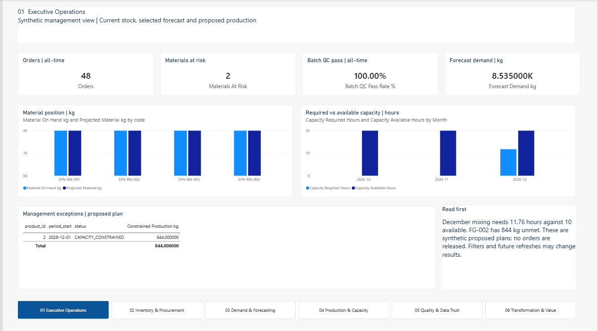
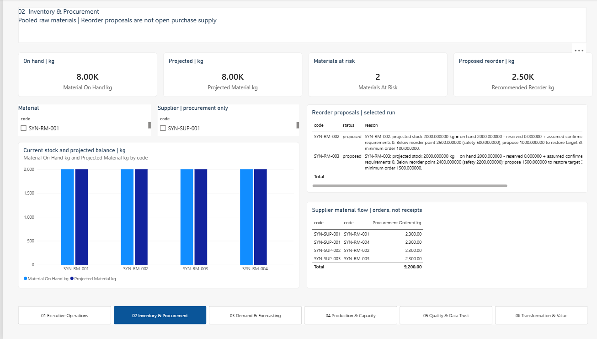
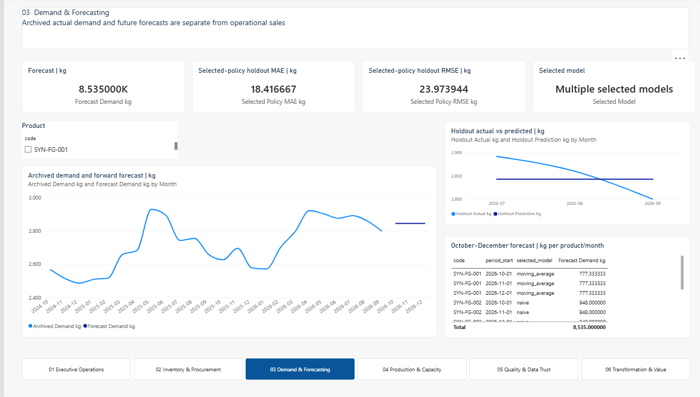
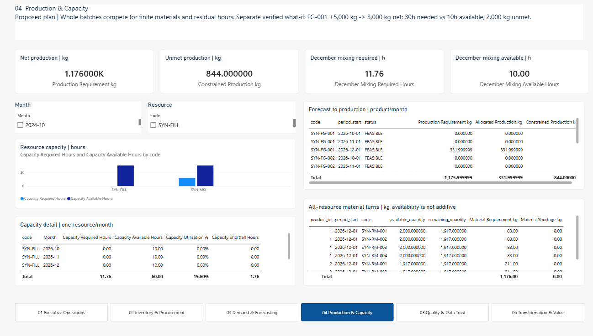
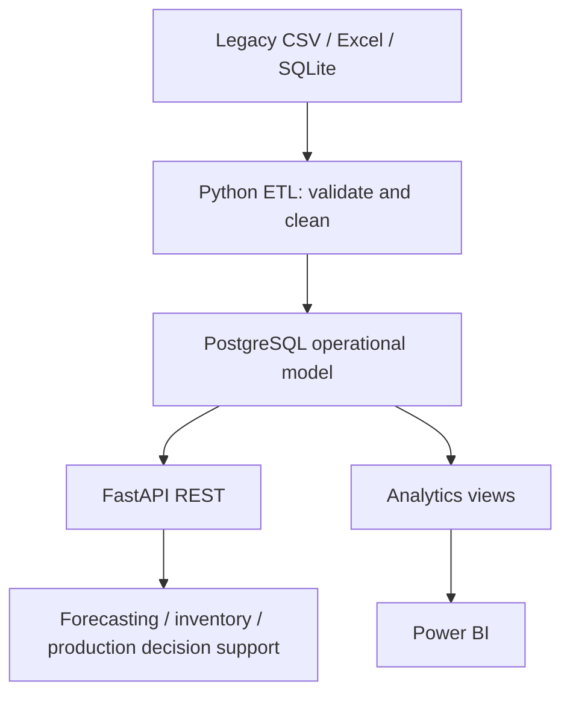

# Rivaline Manufacturing Integrated Operations Platform

Rivaline Manufacturing Ltd is a fictional organisation created for this
digital-transformation case study. All operational data, organisations,
products, formulations and transactions used by the platform are synthetic.

Rivaline represents a UK batch/process manufacturer of industrial coatings. Fragmented
spreadsheets, legacy exports and manual handoffs obscure demand, stock, purchasing,
production, quality and fulfilment. This case study aims to connect those records into
an explainable operational view with forecasting, inventory intelligence and capacity decision support.

## Manufacturing decisions, backed by traceable data

An independent, fictional **manufacturing digital transformation case study** for a general
professional portfolio. Rivaline demonstrates how software engineering and applied analysis can
connect process-manufacturing records into operational intelligence and explainable decision support.
All business scenarios and results are synthetic; no real-world deployment or productivity gain is claimed.

| Capability | Evidence in this project | Business purpose |
|---|---|---|
| Data integration | CSV, Excel and SQLite records mapped into PostgreSQL | Replace disconnected operational views with consistent records |
| ETL and data quality | Validation, quarantine, source keys, run lineage and idempotent replay | Make rejected data visible and prevent duplicate operational loads |
| Traceability | Sales order, batch, material, supplier, quality and shipment relationships | Investigate an exception from customer demand back to source records |
| Forecasting | Chronological evaluation and retained model/run evidence | Make demand assumptions and prediction error inspectable |
| Inventory intelligence | BOM requirements and explainable reorder proposals | Identify material risk without automatically creating purchases |
| Capacity planning | Stock netting, whole-batch allocation and shared resource constraints | Expose feasible production and unmet demand before release |
| Management reporting | Six validated Power BI pages over PostgreSQL views | Connect business questions to reproducible calculations |

**Fictional business-case objective: improve production efficiency by 20%. This is a proposed target,
not a measured achievement.** A real pilot would first agree a baseline such as quality-accepted
kg per production labour-hour, then compare equivalent product mixes and shifts after implementation.
A 20% relative improvement would mean `(pilot efficiency / baseline efficiency - 1) * 100 = 20%`.
Quality, rework, service levels and overtime would need to be monitored alongside throughput.
This prototype demonstrates decision support; it does not establish a causal productivity gain,
financial return or OEE improvement.

## Power BI showcase

These are user-captured screenshots of the validated synthetic dashboard. Only external Desktop
interface strips have been cropped; report figures, labels and visible table content are preserved.
Click an image to inspect it at its saved resolution. Scrollable tables show the captured viewport;
the PBIP provides the interactive report.

### Executive operations

A management overview of 48 orders, two materials at risk, 100% batch QC pass and 8.535K kg forecast
demand. The exception panel highlights 844 kg of capacity-constrained production for follow-up.

[](docs/images/powerbi/executive.png)

### Inventory and procurement

Compare current/projected material positions with 2,500 kg of proposed replenishment. Supplier/material
order detail supports procurement investigation; ordered quantity is explicitly not evidence of receipt.

[](docs/images/powerbi/inventory.png)

### Demand and forecasting

Compare archived demand, future forecasts and holdout predictions. Selected-policy holdout MAE of
18.416667 kg and RMSE of 23.973944 kg communicate uncertainty alongside the 8.535K kg forecast.

[](docs/images/powerbi/forecasting.png)

### Production and capacity

Translate forecast demand into roughly 1,176 kg of net production requirement. December mixing
requires 11.76 hours against 10 available, leaving 844 kg unmet under the whole-batch priority policy.
The broad resource chart aggregates the horizon; the December mixing cards show the specific bottleneck.

[](docs/images/powerbi/production.png)

### Six pages, one reporting model

| Page | Management question |
|---|---|
| 01 Executive Operations | Which operational exceptions need attention? |
| 02 Inventory & Procurement | Which materials need replenishment and which suppliers have orders? |
| 03 Demand & Forecasting | What demand is expected, and how did the selected models perform? |
| 04 Production & Capacity | What can be produced within material and resource constraints? |
| 05 Quality & Data Trust | Are batch results and integrated source records trustworthy? |
| 06 Transformation & Value | How do the technical changes support better business decisions? |

Power BI uses **Import mode**, connecting directly to PostgreSQL through Power Query's
`PostgreSQL.Database` connector. Nineteen imported entities (five dimensions and fourteen reporting
entities) feed a 21-table model, with 25 single-direction relationships and 39 DAX measures.
Trusted SQL reporting views expose ETL/operational results and saved planning snapshots; Power BI
does not call FastAPI to refresh. Server, database and selected run codes are explicit parameters.
Credentials belong in Desktop's local credential store, never in the PBIP or Git.

All six pages passed user-confirmed Desktop open, authentication, refresh and rendering validation,
including the repaired supplier/material visual. See [validation evidence](docs/29-phase-7-validation.md).
Import refresh is manual; no gateway, scheduled refresh or cloud deployment is configured.

## Eight-minute interview demonstration

Prepare the verified database and open the PBIP before the interview; refresh and clear slicer
selections. Use the screenshots as a static fallback. Do not rerun ETL or create new forecast/plan
snapshots during the demonstration.

| Time | Show | Explain |
|---|---|---|
| 0:00-1:00 | Business case and architecture below | Fragmented records, the proposed 20% target and how success would be measured |
| 1:00-2:00 | Executive Operations | Orders, material risk and the December exception |
| 2:00-3:00 | Inventory & Procurement | RM-002 / RM-003 proposals; orders versus receipts |
| 3:00-4:00 | Demand & Forecasting | Separate archive universe, chronological holdout and visible error metrics |
| 4:00-5:30 | Production & Capacity | December / SYN-MIX: 11.76h required, 10h available, 844kg unmet |
| 5:30-6:30 | Quality & Data Trust, then trace command below | 89.66% ETL acceptance, 10.34% rejection, 96 issue events; source-to-order lineage |
| 6:30-8:00 | Transformation & Value | Engineering tradeoffs, evidence boundaries and a realistic pilot evaluation |

For a five-minute version, combine inventory and forecasting and omit the live trace command.
For ten minutes, add OpenAPI and the read-only scenario described in the Phase 6 demo.

```powershell
# Read-only inspection of an already prepared database:
.\.venv\Scripts\python.exe -m scripts.run_etl summary
.\.venv\Scripts\python.exe -m scripts.run_etl trace --order SO-0001
.\.venv\Scripts\python.exe -m scripts.run_planning positions
```

Be ready to discuss why a modular monolith fits the scope; how lineage and quarantine establish
trust; why simple forecasting baselines are appropriate; and how whole-batch planning differs
from an optimised production schedule. Authentication, deployment hardening, richer operational
constraints and a measured pilot remain future work. [Phase 8 evidence](docs/30-portfolio-readiness.md)
records command checks, image provenance and remaining manual checks.

## Current scope

**IMPLEMENTED — Phase 1:** modular Python foundation, environment configuration,
PostgreSQL Compose definition, 23 operational SQLAlchemy tables, deterministic synthetic
master-data seeding, `/health`, unit/constraint tests and architecture documentation.

**IMPLEMENTED - Phase 2:** deterministic SQLite/CSV/Excel legacy fixtures, auditable ETL,
quarantine, idempotent replay, reconciliation, traceability and an Alembic migration baseline.

**IMPLEMENTED - Phase 3:** versioned read-only operational/traceability APIs, eight reporting
views, shared operational KPIs and OpenAPI documentation.

**IMPLEMENTED - Phase 4:** pooled inventory intelligence, BOM requirements, explainable reorder
proposals, immutable calculation snapshots and read-only what-if analysis.

**IMPLEMENTED - Phase 5:** deterministic archived demand, monthly baseline/candidate forecasts,
chronological evaluation, immutable forecast evidence and read-only reporting APIs.

**IMPLEMENTED - Phase 6:** demand netting, batch sizing, shared material/capacity allocation,
computational what-if APIs and reproducible proposed production snapshots.

**IMPLEMENTED - Phase 7:** Power BI import model, DAX catalogue and six PBIR report
pages; code/PostgreSQL checks and user-confirmed Desktop refresh/render validation are complete.

**PLANNED:** authentication. No frontend, distributed
infrastructure or cloud deployment is in scope. This is a local synthetic-data portfolio prototype.

## Target architecture



Python 3.12, PostgreSQL (native 17.11 or Compose 16), SQLAlchemy 2, FastAPI, Pydantic 2,
pandas, scikit-learn,
pytest and Docker Compose form the stack. Pandas and scikit-learn remain available dependencies; the small Phase 5
forecasting models use transparent Decimal arithmetic. Phase 2 additionally uses openpyxl and Alembic.

## Repository

| Path | Responsibility |
|---|---|
| `api/` | App factory, routers, schemas and services |
| `database/` | Settings, lazy engine, authoritative models and synthetic seed |
| `data/legacy/` | Six generated synthetic sources and exact defect manifest |
| `etl/` | Extraction, validation, loading, audit and reconciliation |
| `analytics/` | Shared reporting-view KPI queries |
| `planning/` | Inventory, forecasting, production planning and auditable decision-support snapshots |
| `powerbi/` | Validated PBIP/PBIR/TMDL report, model and reproducibility assets |
| `scripts/` | Schema creation, seeding and API entry points |
| `tests/` | Fast service-independent validation |
| `docs/` | Business case, contracts, ADR and delivery outlines |

Read [AGENTS.md](AGENTS.md) before changing shared interfaces.

## Setup (PowerShell)

Prerequisites: Python 3.12 and either native PostgreSQL (17.11 verified on Windows)
or Docker with Compose. Run commands from the repository root. Choose one database option
below; native PostgreSQL and Docker cannot both bind the same host port.

```powershell
python -m venv .venv
.\.venv\Scripts\python.exe -m pip install -e ".[dev]"
if (-not (Test-Path .env)) { Copy-Item .env.example .env }
```

Edit the Git-ignored `.env` locally and set `POSTGRES_PASSWORD` for your database role.
It is intentionally blank in the template. `.env` is ignored by Git. Environment variables override `.env`. The
application constructs its database URL safely from the individual fields, including
passwords containing punctuation. Do not commit credentials.

### A. Native PostgreSQL

Use a running native server and an existing `rivaline` database. Set `POSTGRES_HOST=localhost`,
`POSTGRES_PORT=5432`, `POSTGRES_DB=rivaline` and `POSTGRES_USER` to your existing database role
(the Windows installer default is `postgres`). Enter its password only in your local `.env`;
do not paste it into chat or tracked files. This verification used the installer role; a dedicated
application role is a later hardening task. If your database does not yet exist, create it using
your local PostgreSQL administration tool before running schema setup.

The URL is constructed as `postgresql+psycopg://<user>:<password>@<host>:<port>/<database>`.
There is no `DATABASE_URL` environment setting; use the separate `POSTGRES_*` fields.

### B. Docker Compose alternative

Keep the Compose deployment as an alternative. It requires hardware virtualization and a
working Docker runtime. It was not locally executed because virtualization is disabled on
this machine. Select a free host port if native PostgreSQL is also running.

```powershell
docker compose up -d postgres
docker compose ps
```

### Schema, seed and API (both options)

```powershell
.\.venv\Scripts\python.exe -m scripts.migrate_db
.\.venv\Scripts\python.exe -m scripts.seed_master_data
.\.venv\Scripts\python.exe -m scripts.run_api
```

Ensure the chosen server is ready before schema creation (wait for health in Compose).
`migrate_db` creates a new schema or verifies/stamps the existing Phase 1 schema without rebuilding it.
The original `init_db` remains a bootstrap-only command; use Alembic for future schema evolution. Seed inserts missing synthetic keys in one
transaction without overwriting existing records; a second run inserts zero rows. Run seeding
as a single process. Conflicting business codes fail and roll back rather than replacing data.

In another terminal:

```powershell
curl.exe -i http://127.0.0.1:8000/health
```

OpenAPI documentation is at `http://127.0.0.1:8000/docs`. `/health` returns the application
name, environment, overall status and database status: HTTP 200 for `up`; HTTP 503 for
`down` or `unconfigured`. It checks `SELECT 1`, not table readiness. Without a configured
database the API still starts and reports degraded health. No connection is opened during
module import. Connection failures are sanitized; connection timeout is three seconds.

On macOS/Linux replace `.\.venv\Scripts\python.exe` with `.venv/bin/python`, use
`cp .env.example .env`, and `curl` instead of `curl.exe`. Virtual-environment activation is
optional. `API_HOST` and `API_PORT` configure `scripts.run_api`. Compose publishes PostgreSQL
on localhost only. An existing server can be selected with `POSTGRES_HOST` and `POSTGRES_PORT`.

```powershell
docker compose stop
```

The stop command applies only to the Compose option and preserves its named PostgreSQL volume.
Changing `.env` credentials does not change
credentials in an already-initialized PostgreSQL volume; update the database role explicitly.

### Preparing the full dashboard on a fresh database

Master seeding alone does not populate the dashboard. On a **new disposable demonstration database**,
follow the Phase 2, 4, 5 and 6 workflows below in order: ingest the synthetic legacy sources, seed
inventory policies and calculate recommendations, ingest archive demand and generate forecasts,
then seed production policies and save the forecast plan. These preparation commands write data.
The second ETL run demonstrates replay and is needed to match the captured 96 issue events.

Use the emitted forecast, reorder and plan run codes in Power BI's `ForecastRunCode`,
`ReorderRunCode` and `PlanRunCode` parameters; confirm `DatasetCode`, `Server` and `Database` too.
Do not assume copied snapshot codes match a different database. Open the checked-in PBIP directly;
`build_powerbi` is optional and overwrites generated files, so it is not part of interview setup.

## Checks

```powershell
.\.venv\Scripts\python.exe -m pytest -q
.\.venv\Scripts\python.exe -m ruff check .
.\.venv\Scripts\python.exe -m ruff format --check .
# Optional live checks after schema creation and seeding:
.\.venv\Scripts\python.exe -m scripts.verify_db
.\.venv\Scripts\python.exe -m pytest -q --postgres
# Docker option only:
docker compose config --quiet
```

Default tests use SQLite with foreign keys enabled and compile PostgreSQL DDL. The explicit
`--postgres` option additionally runs relational tests against your configured live PostgreSQL,
using unique temporary schemas inside rolled-back transactions (requires CREATE on the database).
No PostgreSQL connection is required for default tests. `scripts.verify_db` is read-only and
checks public-schema contracts and seed values; its fingerprint supports repeat-run comparisons.
See [validation](docs/16-phase-1-validation.md) for actual commands and results.

Power BI source checks and read-only integration checks for the prepared demonstration dataset:

```powershell
.\.venv\Scripts\python.exe -m scripts.validate_powerbi
.\.venv\Scripts\python.exe -m pytest -q tests/test_powerbi.py --postgres
```

The BI PostgreSQL tests expect the documented synthetic dataset and selected snapshots. Schema
checks include explicit 2.12 structural compatibility validation for Desktop-saved 2.13 visuals;
the exact 2.13 schema URL was unavailable. Automated checks do not replace manual Desktop rendering.

## Data contracts and roadmap

Seed contains 4 products, 4 materials, 3 suppliers, 3 customers, 2 warehouses, 4 BOM versions
and 16 BOM lines (36 records). All quantities are in kg. The equal-part BOMs are deliberately
abstract relationship examples, not usable paint recipes. No historical transactions are seeded.

See [data architecture](docs/06-data-architecture.md) for relationships and limitations and
[ADR 001](docs/adr/001-prototype-architecture.md) for technology decisions.

1. Phase 1: verified foundation and native PostgreSQL integration.
2. Phase 2: synthetic legacy sources, audited ETL, quarantine, replay and migration baseline.
3. Phase 3: read APIs, traceability, reporting views and descriptive KPIs.
4. Phase 4: inventory intelligence and reorder decision support.
5. Phase 5: monthly demand forecasting and chronological evaluation.
6. Phase 6: monthly production proposals and capacity decision support; no automatic order release.
7. Phase 7: management reporting assets; Desktop refresh/render validation passed.
8. Phase 8: portfolio showcase, command verification and interview readiness.

## Phase 2 demo

After configuration and master seeding:

```powershell
.\.venv\Scripts\python.exe -m scripts.generate_legacy
.\.venv\Scripts\python.exe -m scripts.run_etl run
.\.venv\Scripts\python.exe -m scripts.run_etl summary
.\.venv\Scripts\python.exe -m scripts.run_etl reconcile
.\.venv\Scripts\python.exe -m scripts.run_etl snapshot
.\.venv\Scripts\python.exe -m scripts.run_etl run
.\.venv\Scripts\python.exe -m scripts.run_etl snapshot
.\.venv\Scripts\python.exe -m scripts.run_etl trace --order SO-0001
```

Expected complete execution: 464 source rows = 416 accepted + 48 rejected. First load inserts
944 operational rows; replay inserts zero. Audits grow on every execution. Inspect
`data/quarantine/<run>/rejected.json` and `summary.json`; folders are ignored by Git.
The manifest identifies every intentional defect. Regeneration resets sources only.

See the [runbook](docs/18-etl-runbook.md), [mappings](docs/07-integration-design.md),
[data-quality policy](docs/08-data-quality.md) and [Phase 2 evidence](docs/17-phase-2-validation.md).

## Phase 3 demo

Retain the Phase 2 integrated database, then apply the view migration and start the API:

```powershell
.\.venv\Scripts\python.exe -m scripts.migrate_db
.\.venv\Scripts\python.exe -m scripts.run_api
```

In another terminal:

```powershell
curl.exe http://127.0.0.1:8000/health
curl.exe "http://127.0.0.1:8000/api/v1/sales-orders?limit=5&status=confirmed"
curl.exe "http://127.0.0.1:8000/api/v1/inventory?warehouse_id=1"
curl.exe http://127.0.0.1:8000/api/v1/traceability/order/1
curl.exe http://127.0.0.1:8000/api/v1/kpis/operations
```

Use the actual integer order ID from the list (the standard fixture starts with SO-0001).
Open `/docs` or `/openapi.json` for filters and response contracts. The Phase 3 business routes are GET-only;
list pages contain items/total/limit/offset. Decimal quantities are strings. No authentication is
implemented; this remains a local synthetic-data prototype.

See [API/view catalogue](docs/19-api-and-analytics.md), [KPI dictionary](docs/20-kpi-dictionary.md),
[Phase 3 validation](docs/21-phase-3-validation.md) and the [Power BI project](powerbi/README.md).


## Phase 4 demo

Preserve the Phase 2/3 integrated database. Policies are synthetic; recommendations do not create POs.

```powershell
.\.venv\Scripts\python.exe -m scripts.migrate_db
.\.venv\Scripts\python.exe -m scripts.run_planning seed-policies
.\.venv\Scripts\python.exe -m scripts.run_planning positions
.\.venv\Scripts\python.exe -m scripts.run_planning requirements
.\.venv\Scripts\python.exe -m scripts.run_planning calculate
.\.venv\Scripts\python.exe -m scripts.run_planning calculate
.\.venv\Scripts\python.exe -m scripts.run_api
```

In another terminal:

```powershell
curl.exe http://127.0.0.1:8000/api/v1/inventory/positions
curl.exe http://127.0.0.1:8000/api/v1/planning/material-requirements
curl.exe "http://127.0.0.1:8000/api/v1/reorder-recommendations?status=proposed"
curl.exe "http://127.0.0.1:8000/api/v1/planning/material-availability?product_id=1&quantity=10000&unit_of_measure=kg"
```

The preserved fixture yields two proposals: RM-002 1,000 kg and RM-003 1,500 kg. Exact-input replay
adds none. All production is completed, so current material requirements are empty. The what-if
exposes 500 kg shortage for each material without saving anything. Stock is pooled across warehouses;
reservations and known requirements are conservatively additive, and confirmed purchases are assumed
wholly outstanding. Read the [calculation contract](docs/22-inventory-and-reorder.md) and
[validation report](docs/23-phase-4-validation.md) before interpreting these demonstration values.


## Phase 5 demo

The original sales history spans two months. The separately labelled 24-month archived-demand
fixture supports evaluation without changing prior operational sales or inventory planning.

```powershell
.\.venv\Scripts\python.exe -m scripts.migrate_db
.\.venv\Scripts\python.exe -m scripts.run_forecasting generate-history
.\.venv\Scripts\python.exe -m scripts.run_forecasting ingest-history
.\.venv\Scripts\python.exe -m scripts.run_forecasting forecast
.\.venv\Scripts\python.exe -m scripts.run_forecasting forecast
.\.venv\Scripts\python.exe -m scripts.run_api
```

The forecast command returns a run_code, all candidate metrics and 12 product-month forecasts.
Replay adds no rows. To inspect an incremental material scenario, use the returned code:

```powershell
$forecastRun = "REPLACE_WITH_RETURNED_RUN_CODE"
.\.venv\Scripts\python.exe -m scripts.run_forecasting demo-bom --run-code $forecastRun --product-id 1
curl.exe http://127.0.0.1:8000/api/v1/forecasts
curl.exe http://127.0.0.1:8000/api/v1/forecasts/1
curl.exe "http://127.0.0.1:8000/api/v1/forecasts/evaluation?scope=overall&evaluation_split=test"
curl.exe "http://127.0.0.1:8000/api/v1/forecasts/history?product_id=1"
```

Dates default to cutoff 2026-09-30 and forecast October-December 2026. Archive import rejects missing
months and conflicting replay. Model selection uses validation MAE; every candidate's final holdout
results are retained. Forecasts do not create orders or reorder proposals. Read the
[forecast contract](docs/24-demand-forecasting.md) and [Phase 5 validation](docs/25-phase-5-validation.md)
for measured synthetic results and limitations. No calibrated prediction intervals are claimed.

## Phase 6 demo

Use the preserved Phase 5 run code. Forecast and additional manual demand are separate scenarios;
these are proposed plans, not approved schedules. The explicit save command writes reporting
snapshots only. What-if and all HTTP routes create no records.

```powershell
.venv\Scripts\python.exe -m scripts.migrate_db
.venv\Scripts\python.exe -m scripts.run_production seed-policies
$forecastRun = "1e8d547d27460bb77d408e542c17682cd11ea6b745bd4dd898ec6d34b135464e"
.venv\Scripts\python.exe -m scripts.run_production forecast --forecast-run-code $forecastRun
.venv\Scripts\python.exe -m scripts.run_production save-forecast --forecast-run-code $forecastRun
.venv\Scripts\python.exe -m scripts.run_production what-if --product-id 1 --period 2026-11-01 --quantity 5000 --unit kg
.venv\Scripts\python.exe -m scripts.run_api
```

In another terminal, use the same forecast run code:

```powershell
$forecastRun = "1e8d547d27460bb77d408e542c17682cd11ea6b745bd4dd898ec6d34b135464e"
curl.exe "http://127.0.0.1:8000/api/v1/planning/production-plan?forecast_run_code=$forecastRun"
curl.exe "http://127.0.0.1:8000/api/v1/planning/capacity?forecast_run_code=$forecastRun"
$scenario = @{demands=@(@{product_id=1; period_start="2026-11-01"; quantity="5000"; unit_of_measure="kg"})} | ConvertTo-Json -Depth 3
Invoke-RestMethod -Method Post -Uri "http://127.0.0.1:8000/api/v1/planning/production-plan/what-if" -ContentType "application/json" -Body $scenario
```

The synthetic October-December plan nets existing stock once across the horizon. December needs
331.999999 kg of FG-001 and 844 kg of FG-002; together they require 11.76 mixing hours against 10.
Priority allocates FG-001's whole batch first; FG-002's batch remains capacity-constrained.
See [planning contract](docs/26-production-planning.md) and [validation report](docs/27-phase-6-validation.md)
for assumptions, scenarios, preservation evidence and measured synthetic KPIs. The Phase 7 dashboard presents these results; automatic purchasing/production release is not implemented.

## Phase 7 Power BI

Open [RivalineOperations.pbip](powerbi/RivalineOperations.pbip) in Power BI Desktop. Enter local
PostgreSQL credentials through Desktop's authentication dialog and refresh; credentials are not
stored in project definitions. The retained original PBIX is ignored and is not the Phase 7 report.

Code/schema checks and PostgreSQL reconciliation are separate from Desktop validation. Follow the
[Power BI runbook](powerbi/README.md), [architecture/demo guide](docs/28-powerbi-management-intelligence.md)
and [Phase 7 evidence](docs/29-phase-7-validation.md). No commit, push or later-phase work is automatic.
