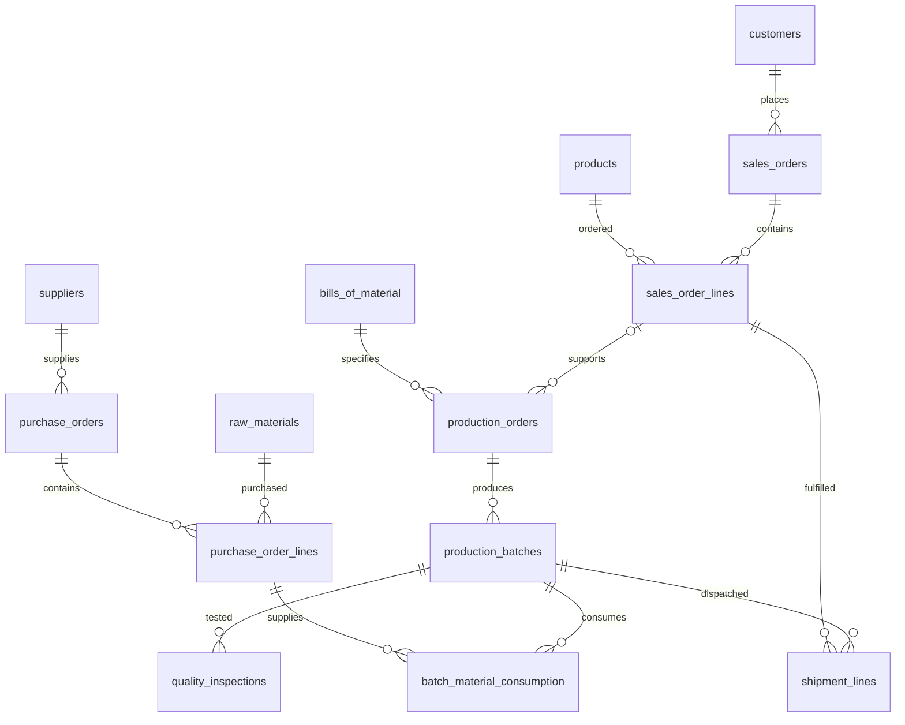

# Data architecture and stable contracts

`database/models.py` is the authoritative schema (23 tables). Surrogate integer keys join
records; unique codes identify master records and document headers. All tables carry
`created_at`, `updated_at`, `source_system`, and nullable `source_record_id`. Each entity
enforces unique `(source_system, source_record_id)` when the record key is supplied.
Timestamps use PostgreSQL timezone-aware types. SQLAlchemy updates `updated_at`; direct
SQL clients must maintain it themselves. Quantities use NUMERIC(18,6), GBP prices NUMERIC(18,2).

| Domain | Tables |
|---|---|
| Master | products, raw_materials, suppliers, customers, warehouses |
| Stock | inventory, inventory_transactions |
| Formulation | bills_of_material, bill_of_material_lines |
| Sales | sales_orders, sales_order_lines |
| Procurement | purchase_orders, purchase_order_lines |
| Production | production_orders, production_batches, batch_material_consumption |
| Quality | quality_inspections |
| Logistics | shipments, shipment_lines |
| Planning | demand_forecasts, reorder_recommendations |
| Governance | etl_runs, data_quality_issues |

## Grain and integrity

- Inventory: one item/warehouse/lot. Exactly one product or material FK is present; separate
  unique constraints cover each item type. Quantity and reservations cannot be negative or
  over-reserved. Transactions have nonzero signed deltas and direction checks.
- BOM: one product/version with positive base output; lines specify positive material
  quantities in the material's canonical unit. Seed uses only kg. No unit conversion is implied.
- Production: one product/BOM and optional sales line per order; multiple batches per order.
  Composite FKs enforce product agreement between BOM, sales line, production order and batch.
- Consumption: one batch/material/purchase-line/supplier-lot event. The mandatory purchase
  line identifies the actual supplier, independently of a material's preferred supplier.
- Shipment line: a quantity from a batch allocated to a sales line; composite FKs enforce
  the same product. Multiple shipments/batches can fulfil a line. Customer is derived from
  the sales line. One shipment may consolidate multiple orders/customers in this prototype.
- Forecast: product/period/model/generation snapshot. Reorder: material/warehouse suggestion
  with explanation. These are storage contracts only; algorithms are not implemented.
- ETL run: counters/status/timing; quality issue: rule, severity, entity and source key per run.

Foreign keys are indexed; deletion does not cascade through operational history. Check
constraints restrict statuses, dates and quantities. No automatic stock posting is implemented.

## Deliberate Phase 1 limits

Inventory lot codes are not yet foreign keys to batch/receipt records. Receiving events,
transfers, stock-ledger reconciliation, quantity allocation limits, one-recipient shipment
validation, quality-release gates, state transitions and BOM mass-balance checks require
transactional services in later phases. Non-seed units require explicit validation/conversion.
Order allocation supports one optional sales line per production order, not a many-to-many
allocation plan. Material consumption requires a purchase line; opening-stock lineage needs
an explicit future receipt model. No actual employee or inspector data is stored.

`create_all` bootstraps an empty database and is not a migration strategy. Introduce reviewed
migrations before changing a persisted schema. SQLite tests and PostgreSQL SQL compilation
do not substitute for live PostgreSQL tests.

## Phase 2 extension

The 23 business tables and seed contracts are unchanged. Alembic baseline 0001_phase1 adds
only migration version bookkeeping when adopting the verified DB. ETL uses existing provenance,
run counters and issue JSON; source mappings and remaining limitations are in document 07.

## Phase 3 reporting extension

Migration 0002_reporting adds eight read-only reporting views; the 23 operational entities and
master/ETL data contracts remain unchanged. View grains and KPI limitations are defined in
documents 19 and 20. No actual receipt or production-event timestamp has been invented.

Phase 4 adds planning_policies (one pooled raw-material policy) and planning_runs (immutable
input/result snapshots). Original 23 tables retain their columns and constraints. The existing
reorder_recommendations table stores positive proposals linked through its unique source keys.
Three new planning views and migrations 0003/0004 are documented in document 22 and ADR 004.

Phase 5 adds demand_observations, forecast_runs, forecast_metrics and forecast_backtests while
reusing demand_forecasts unchanged. Archived demand is a separate evaluation universe and is not
added to operational sales. Migration 0005 and four forecasting views preserve earlier contracts.
See document 24 and ADR 005 for grains, source lineage and immutable-run semantics.
