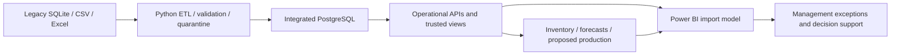

# Power BI management intelligence

The fictional Rivaline prototype now has a source-controlled Power BI import model and six
management report pages. This layer reads the verified platform; it does not alter data or call
operational write APIs. Desktop refresh/render validation is the next explicit manual step.

## Architecture and authority

The user-created Power BI Desktop 2.158.1177.0 project is the authority: PBIP 1.0, report definition
4.0/PBIR folder, report schema 3.3.0, page schema 2.1.0, semantic definition 4.2, TMDL compatibility
1606, culture en-US. Existing .platform identifiers, PBIP/byPath references, database.tmdl,
culture and base-theme files remain intact. The original first blank page ID is reused.

The model consumes 14 existing reporting views plus five small master/configuration dimensions.
Calendar and Metrics bring the model to 21 entities. No new PostgreSQL views, schema migrations,
API contracts or operational records were needed. This avoids parallel KPI definitions in SQL.

The exact grains, relationships, formulas and filter scope are in
[model and measures](../powerbi/model-and-measures.md). All 25 relationships are dimension-to-fact,
one-to-many, single-direction. Backtest selected-model matching occurs before load against a
distinct four-product selection, not a fact-to-fact relationship or a repeated horizon join.

## Management use

The six pages answer: What needs attention? Which materials need review? What demand is expected?
What can the proposed plan produce? Can managers trust the data? How does integration support
decisions? The [visual build specification](../powerbi/page-build-specification.md) records all
62 visual types, positions, bindings and manual acceptance checks. It is also the fallback if
Desktop requires recreating a visual. No financial ROI or time-saving benefit is fabricated.

## Data and vintage boundaries

ForecastRunCode, PlanRunCode and ReorderRunCode are explicit text parameters, fixed initially to
verified snapshots. DatasetCode selects the separate synthetic history. Server and Database are
nonsecret connection parameters. The plan import also filters forecast_run_code; incompatible
or empty forecast/plan selections raise a Power Query error. Capacity/material queries depend
on a valid matching plan. Refresh does not generate forecasts, recommendations or new plans.

Operational sales are not added to archived demand; future forecasts are not evaluated against
missing future actuals. Holdout variance, MAE and RMSE use selected-model July-September test
observations only. Candidate metric rows are not averaged. Percentages use DIVIDE and retain
blank on zero denominators. December shared capacity is counted once per resource/month, not
once per product line. Constrained production measures unmet quantity, not the complete quantity
of a partially allocated line. Current inventory is separate from saved planning snapshots.

## Local connection and credentials

Target server `localhost`, port `5432`, database `rivaline`; the M server parameter is
`localhost:5432`. `PostgreSQL.Database` uses the connector's normal authentication flow.
No user/password field or credential string is embedded in M, TMDL, PBIP or report files.

1. Close any existing instance of this project to avoid overwriting external changes with an old
   in-memory version. Open `powerbi/RivalineOperations.pbip` in Power BI Desktop.
2. In Transform data / Manage parameters, verify Server, Database, DatasetCode and the three run
   identifiers in `definition/expressions.tmdl`. Keep the verified defaults for the first demo.
3. In File / Options and settings / Data source settings, select the PostgreSQL source and edit
   permissions. Choose database authentication and enter the existing local username/password
   into Desktop's credential dialog only. Do not paste credentials into queries or repository files.
4. Refresh all tables. If the connector requests approval for a data source or privacy level,
   review the local PostgreSQL source and choose the appropriate local privacy setting. Do not
   disable privacy/security checks to bypass a credential or connector failure.
5. Verify values using the acceptance table and demo below. Save the PBIP after successful manual
   validation, inspect Git changes, and keep .pbi/PBIX artifacts ignored. Do not commit automatically.

A dedicated read-only database reporting role is recommended for later hardening; this phase did
not create users, grant privileges, or expose the existing local password. Desktop credentials
are separate from Python's ignored .env. No service deployment, gateway or scheduled refresh is
configured. Restart/reopen after external model edits if Desktop does not detect them.

## Source control and reproducibility

Include PBIP, .platform, definition.pbir/definition.pbism, TMDL definitions, textual report/pages/
visuals, required original base theme, model-spec/page-spec, builder/validator, documentation and
synthetic validation evidence. The original PBIX is a binary user-created artifact with cached
model/report state: it is retained byte-for-byte locally but ignored, not treated as the current
Phase 7 source. Do not open it expecting the newly authored report.

All `.pbi/` folders are ignored because they contain cache.abf and machine/user-local settings,
including security-binding metadata. The local `.phase7-backup/` preserves original textual
project files and is ignored. No original user artifact was deleted. One obsolete newly generated
visual was removed after a title change; the validator now detects such leftovers explicitly.

`build_powerbi` uses versioned model/page specifications and templates, not local credentials or
live database calls. Generated definitions are committed candidates, so regeneration is optional
for consumers. It overwrites generated definitions: review/port any Desktop edits before using
it again. Generation no longer depends on the ignored backup. Tests compare two independent generations byte-for-byte, then compare saved Desktop bindings
and M expressions against generated contracts. Desktop serialization and lineage tags are retained. Model-spec is the declared source of table/column/grain/parameter
and measure contracts; page layouts are authored in the builder and exported to page-spec.

Official schemas are pinned in powerbi/schemas for offline checks. The theme's visual version
metadata is not assumed to be a visualContainer schema number: the attempted 2.13.0 URL was
unpublished, so new visuals use Microsoft's published 2.12.0 container schema and its actual
references. Existing project schema versions were not downgraded or changed. This proves JSON
conformance, not runtime renderer compatibility. See the schema README and manual boundary.

## Validation and limits

Three statuses are separate: code/static verification; PostgreSQL reconciliation; Desktop model
load, Power Query refresh, DAX execution and visual rendering. The automated checks passed, and the user separately confirmed all six pages opened, refreshed
and rendered successfully after the supplier/material binding fix; see Phase 7 evidence. TMDL files received structural/binding checks, not a native semantic-engine parse.
The installed server libraries did not expose a usable TmdlSerializer in the local PowerShell
probe; no unsupported engine or GUI operation was used to manufacture a pass.

Power BI numbers are binary floating point; six-place display retains the prototype quantities,
but PostgreSQL Decimal remains authoritative. Use 0.000001 tolerance for quantities and 0.01h
for displayed hours. There are no supported financial ROI, OEE, measured delivery reliability,
calibrated forecast intervals or automatic production/purchasing measures. Capacity remains
conditional on Phase 6 assumptions; current stock and historical snapshots can diverge after
future data changes. Static narrative text describes the verified demo, not a live calculation.

## Interview/demo walkthrough

1. Executive: explain synthetic orders, material risk, QC and future demand. Highlight the
   December exception; do not confuse high all-time QC with an approved production schedule.
2. Inventory: select RM-002 and RM-003 and confirm proposed reorder 1,000 and 1,500 kg. Explain
   that proposals are not incoming supply and supplier selection affects procurement only.
3. Forecasting: select each product to show three monthly forecasts. Clear product selection to
   show selected-policy holdout MAE 18.416667 kg and RMSE 23.973944 kg. The history/forecast line
   uses the archive universe; the separate holdout chart compares actual and predicted periods.
4. Production: select 2026-12 and SYN-MIX. Confirm 11.76 required/10 available hours and 117.60%.
   FG-001's whole batch is prioritised; FG-002 has 844 kg unmet. Explain why spare hours elsewhere
   do not remove this bottleneck. The separate 5,000kg what-if is a labelled Phase 6 reference.
5. Trust: show pass/fail inspection counts, weighted ETL acceptance/rejection and issues by source
   and rule. Explain two replay executions versus unique source records and API traceability.
6. Transformation: connect sources, validation, shared data and explainable planning to the manager's
   next decision. No measured ROI or operational time saving is claimed.

## Official format references

- [Microsoft PBIR report project format](https://learn.microsoft.com/en-us/power-bi/developer/projects/projects-report)
- [Microsoft semantic-model project files](https://learn.microsoft.com/en-us/power-bi/developer/projects/projects-dataset)
- [TMDL format](https://learn.microsoft.com/en-us/analysis-services/tmdl/tmdl-overview)
- [PostgreSQL.Database connector expression](https://learn.microsoft.com/en-us/powerquery-m/postgresql-database)

These references explain file/connection formats; project-specific numeric claims are supported
by PostgreSQL evidence in the Phase 7 validation report, not by vendor documentation.
